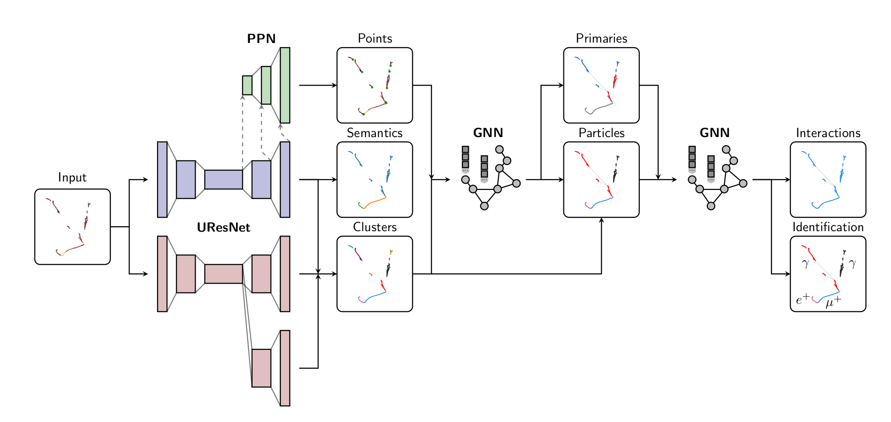

## 1. What is the full reco chain?
> *... a modular,  end-to-end,  ML-based reconstruction chain which takes 3D particle interaction images as an input and hierarchically extracts increasingly high-level information at each stage by building upon the previous steps.*
> (NIPS workshop paper, thanks François!)


For each stage, click on the link to see more performance plots and benchmark numbers.

!> TODO: make sure each page below is up to date.


1. [UResNet](chain/uresnet.md) [Laura/Patrick]
2. [PPN](chain/ppn.md) [Laura/Patrick]
3. [Dense clustering (SPICE)](chain/spice.md) [Dae Heun]
4. [Track clustering (GRAPPA)](chain/track.md) [François]
5. [Shower clustering (GRAPPA)](chain/shower.md) [François]
6. [Interaction clustering (GRAPPA)](chain/interaction.md) [Qing/François]
7. [Particle hierarchy, type & kinematics](chain/kinematics.md) [Dae Heun]
8. [Neutrino vertex identification](chain/vertex.md) [Laura]
9. [Nu vs cosmic](chain/cosmic.md) [Laura]

See the nice visualization of each step made by Kazu [here](http://web.stanford.edu/~kterao/DataVis-dunend-08-26.html).

## 2. [Training the full chain](chain/train.md)
If you want to see...
- a standard configuration, what are the outputs, how to interprete and visualize them,
- different configuration options and how they differ in reconstruction performance output,
- how to train the full chain,

Please visit [this page](chain/train.md).

## 3. [Questions and Answers](chain/questions.md)
Questions commonly asked abour our work and some examples of proper answers.

## 4. Citations
**NIPS workshop 2020, Full chain paper**
Drielsma, Francois, et al. "Scalable, End-to-End, Deep-Learning-Based Data Reconstruction Chain for Particle Imaging Detectors." arXiv preprint arXiv:2102.01033 (2021).
```
@article{FullChain,
  title={Scalable, End-to-End, Deep-Learning-Based Data Reconstruction Chain for Particle Imaging Detectors},
  author={Drielsma, Francois and Terao, Kazuhiro and Domin{\'e}, Laura and Koh, Dae Heun},
  journal={arXiv preprint arXiv:2102.01033},
  year={2021}
}
```

**SSCN paper**
Dominé, Laura, Kazuhiro Terao, and DeepLearnPhysics Collaboration. "Scalable deep convolutional neural networks for sparse, locally dense liquid argon time projection chamber data." Physical Review D 102.1 (2020): 012005.
```
@article{SSCN,
  title={Scalable deep convolutional neural networks for sparse, locally dense liquid argon time projection chamber data},
  author={Domin{\'e}, Laura and Terao, Kazuhiro and DeepLearnPhysics Collaboration and others},
  journal={Physical Review D},
  volume={102},
  number={1},
  pages={012005},
  year={2020},
  publisher={APS}
}

```
**PPN paper**
Dominé, Laura, et al. "Point Proposal Network for Reconstructing 3D Particle Positions with Sub-Pixel Precision in Liquid Argon Time Projection Chambers." arXiv preprint arXiv:2006.14745 (2020).
```
@article{PPN,
  title={Point Proposal Network for Reconstructing 3D Particle Positions with Sub-Pixel Precision in Liquid Argon Time Projection Chambers},
  author={ Domin{\'e}, Laura and de Soux, Pierre C{\^o}te and Drielsma, Fran{\c{c}}ois and Itay, Ran and Koh, Dae Heun and Lin, Qing and Terao, Kazuhiro and Tsang, Ka Vang and Usher, Tracy},
  journal={arXiv preprint arXiv:2006.14745},
  year={2020}
}

```
**SPICE paper**
Koh, Dae Heun, et al. "Scalable, Proposal-free Instance Segmentation Network for 3D Pixel Clustering and Particle Trajectory Reconstruction in Liquid Argon Time Projection Chambers." arXiv preprint arXiv:2007.03083 (2020).
```
@article{CNNClustering,
  title={Scalable, Proposal-free Instance Segmentation Network for 3D Pixel Clustering and Particle Trajectory Reconstruction in Liquid Argon Time Projection Chambers},
  author={Koh, Dae Heun and de Soux, Pierre C{\^o}te and Domin{\'e}, Laura and Drielsma, Fran{\c{c}}ois and Itay, Ran and Lin, Qing and Terao, Kazuhiro and Tsang, Ka Vang and Usher, Tracy},
  journal={arXiv preprint arXiv:2007.03083},
  year={2020}
}

```
**GRAPPA paper**
Drielsma, Francois, et al. "Clustering of Electromagnetic Showers and Particle Interactions with Graph Neural Networks in Liquid Argon Time Projection Chambers Data." arXiv preprint arXiv:2007.01335 (2020).
```
@article{GNNClustering,
  title={Clustering of Electromagnetic Showers and Particle Interactions with Graph Neural Networks in Liquid Argon Time Projection Chambers Data},
  author={Drielsma, Francois and Lin, Qing and de Soux, Pierre C{\^o}te and Domin{\'e}, Laura and Itay, Ran and Koh, Dae Heun and Nelson, Bradley J and Terao, Kazuhiro and Tsang, Ka Vang and Usher, Tracy L},
  journal={arXiv preprint arXiv:2007.01335},
  year={2020}
}

```

## Event displays
> File: `/gpfs/slac/staas/fs1/g/neutrino/ldomine/.scn_paper/shower_relabel/test_768px.root`
> Index: 66

.png ":size=300") .png ":size=300")
*Left: input data. Right: semantic labels.*
