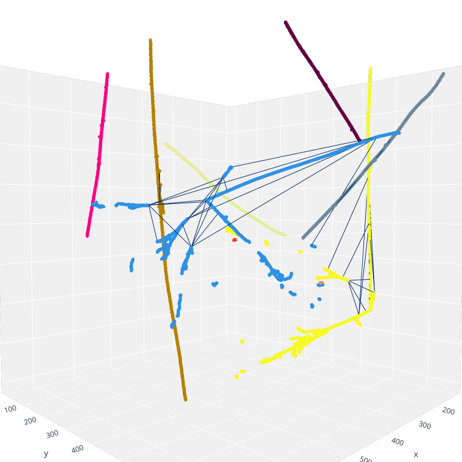
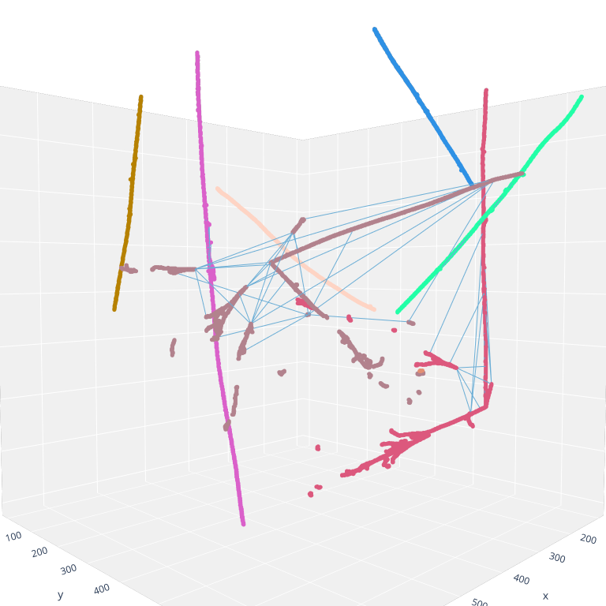
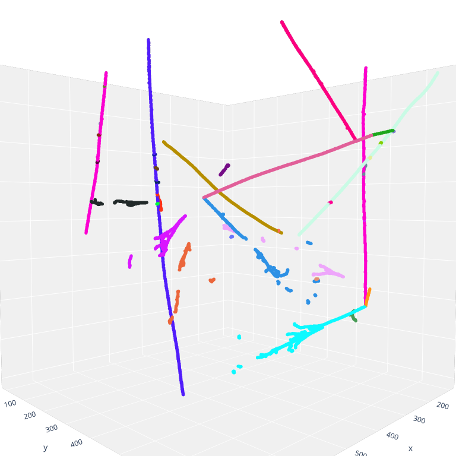

## Performance
[inter_grouping_ari_vs_nnu.pdf](figures/performance/inter_grouping_ari_vs_nnu.pdf)

[inter_grouping_ari_vs_ninter.pdf](figures/performance/inter_grouping_ari_vs_ninter.pdf)

[2nu_interaction_grouping_metrics_hist.pdf](figures/performance/2nu_interaction_grouping_metrics_hist.pdf)

## Event displays
!> Event 25+26 of ??

### Interaction grouping
 
*Left: predictions. Right: Labels.*

### Group labels

