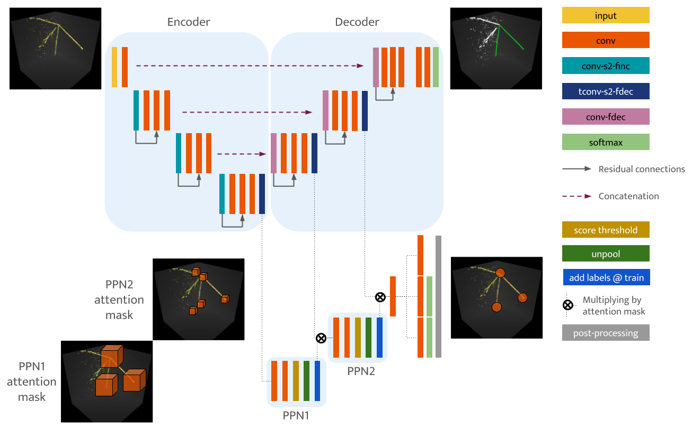
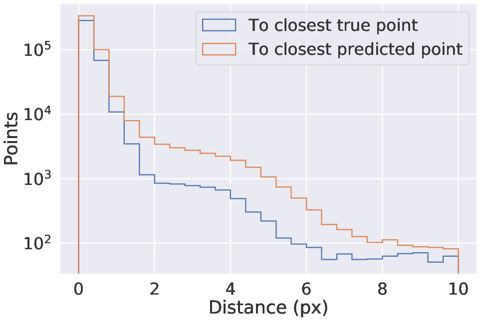
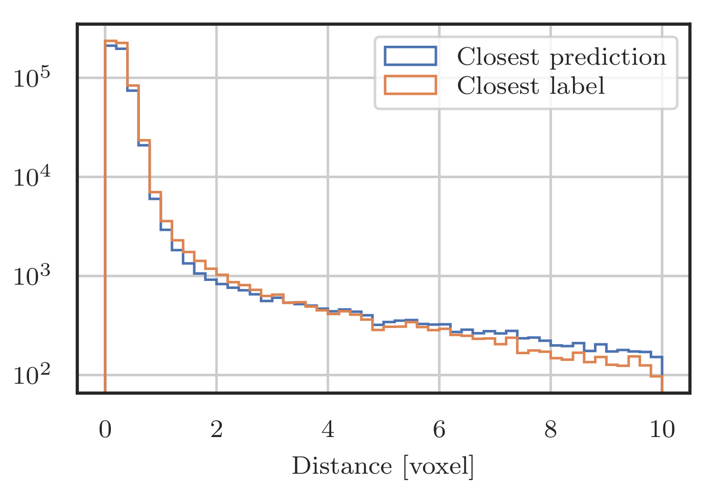
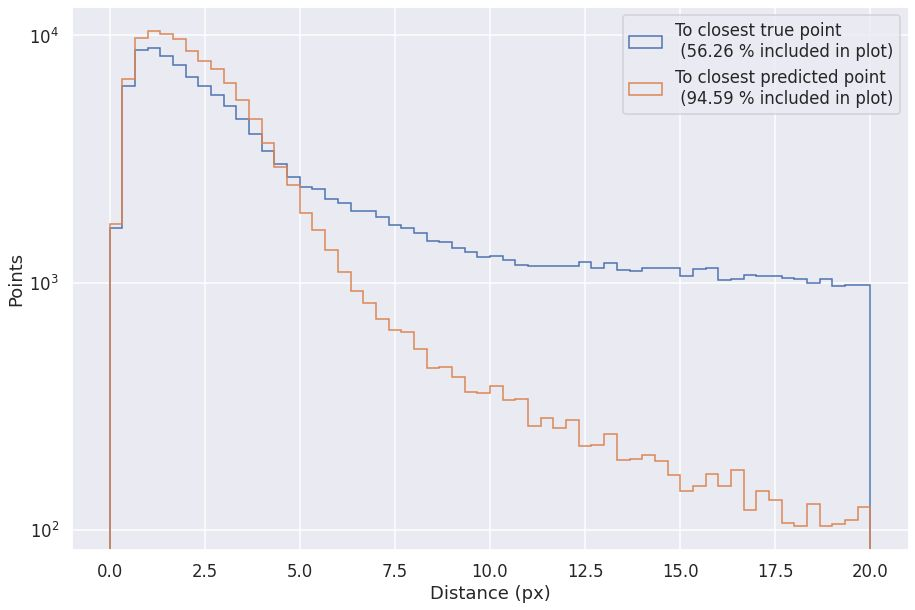
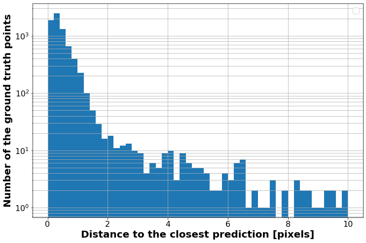
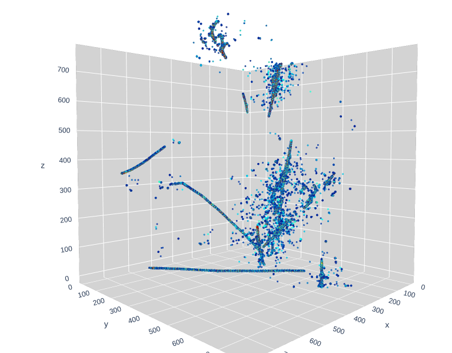
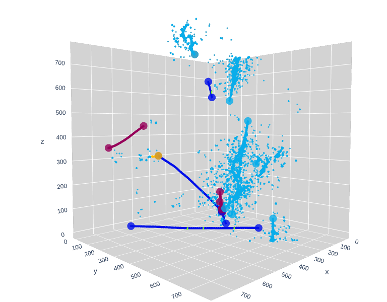
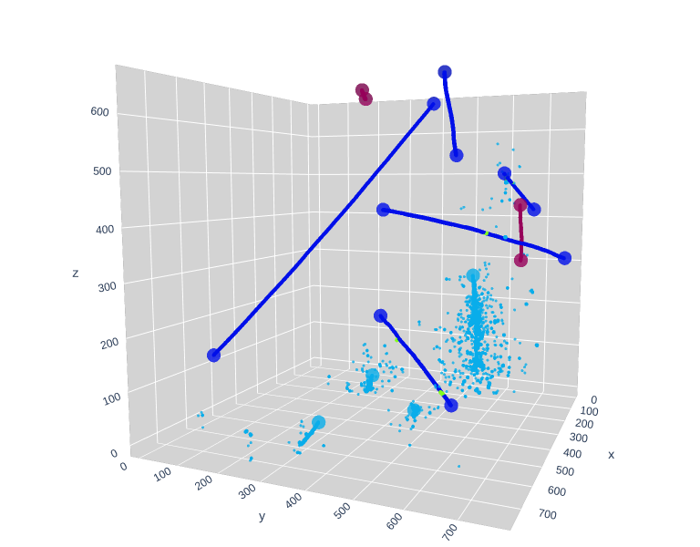

## 1. Network Architecture

## 2. Performance
### PILArNet (old, w/o ghost points)
From PPN paper

### PILArNet (new, w/o ghost points)
From NIPS 2020 workshop paper, by François

### ICARUS simulation (w/ ghost points)
As of January 2021, by Laura

### Unknown
Need to clarify where this comes from

## 3. Event displays
From PPN paper = PILArNet old dataset, data and labels:

Example of PPN predictions:

