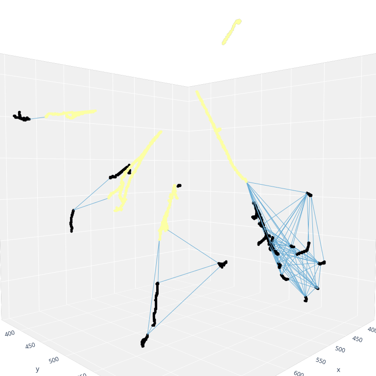
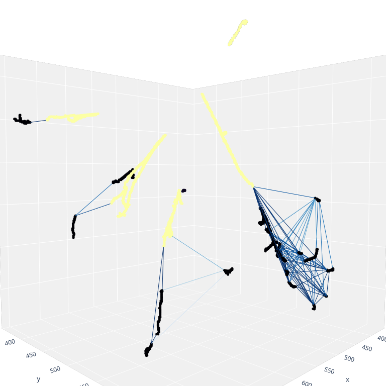
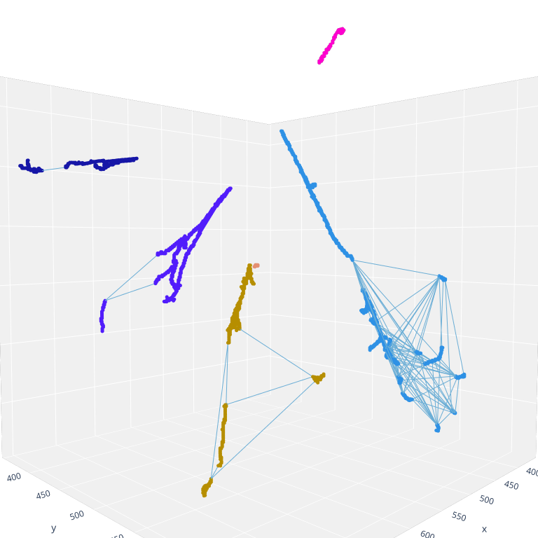
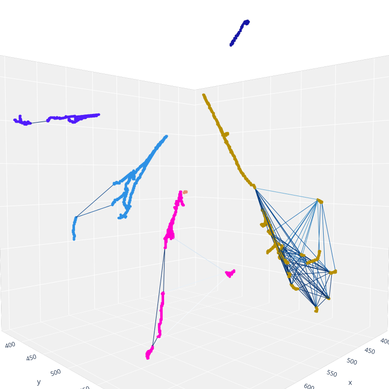
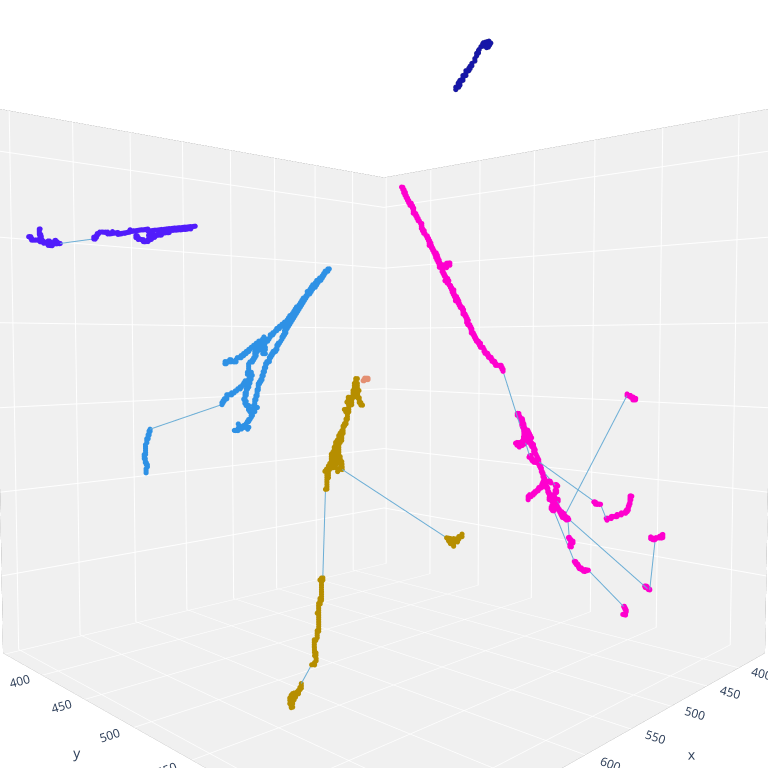
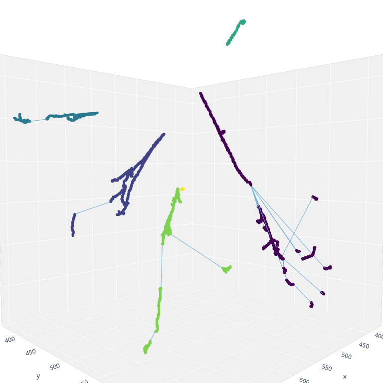
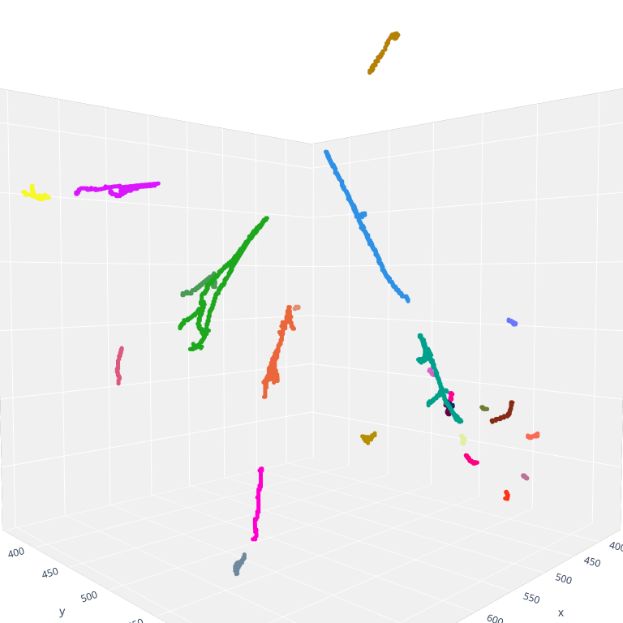
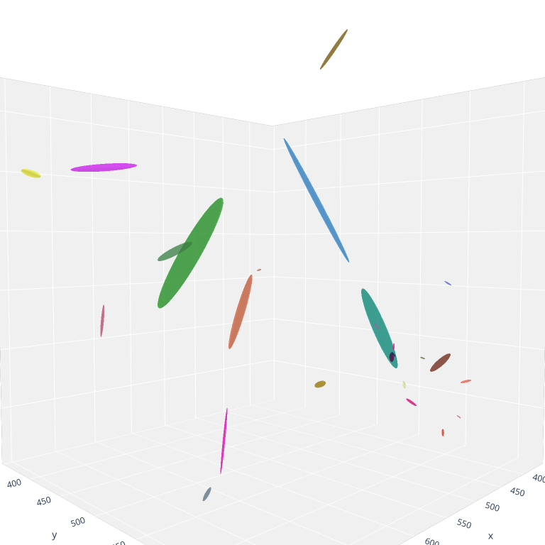
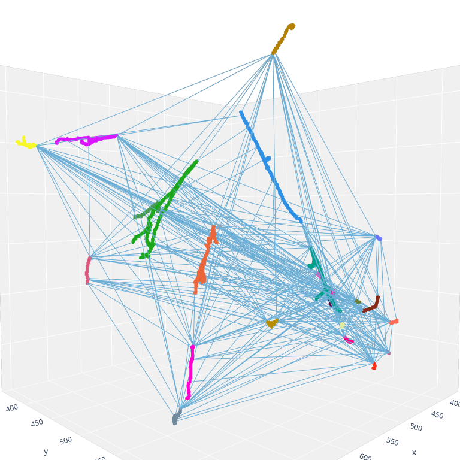

## Performance

[shower_primary_score_hist.pdf](figures/performance/shower_primary_score_hist.pdf)

[shower_clustering_metrics_hist.pdf](figures/performance/shower_clustering_metrics_hist.pdf)

## Event Displays
!> Event 25 of ??

### Primary prediction
 
*Left: Labels. Right: Predictions.*

### Group prediction

 
*Left: labels. Right: predictions.*

### Misc.
#### Selected edges:

#### Photon edges:

#### Shower fragments:

#### Shower fragments w/ ellipses:

#### Complete graph:

