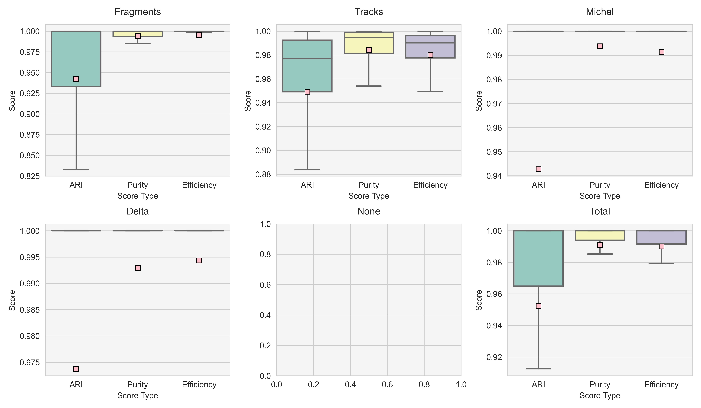

# Voxel Clustering

Voxel clustering refers to the task of clustering point cloud data into different particle IDs. 
Currently there are two neural-network based models for voxel clustering: SPICE, GraphSPICE, and Sparse Mask-RCNN. 

## 1. SPICE

### A. Description


### B. Training/Testing

### C. Performance
#### PILArNet (w/o ghost points)


#### ICARUS simulation (w/ ghost points)
From January 2021, by Laura


### D. Event displays

[event_test_25_cnn_clust_label_vs_pred.pdf](figures/event_displays/event_test_25_cnn_clust_label_vs_pred.pdf)


## 2. GraphSPICE


### A. Description

**GraphSPICE** is an enhancement of **SPICE** to explicitly use local geometric information during label generation. This is done by applying an edge classification loss to a k-nearest neighbor graph over the 3D voxel coordinates. During inference, the labels are generated by dropping edges with low probability scores and counting the remaining connected components. 

**GraphSPICE** models have two to three major components: 1) **Embedder**, 2) **Similarity Kernel**, and an optional 3) **VoxelGNN**.  
 1. **Embedder** is a trainable CNN-based coordinate transform that maps input voxels with respect to some similarity loss (ex. Vanilla **SPICE** is an example of an **embedder**). 
 2. **Similarity Kernel** $K$ is a function $K: (x_1, x_2) \in \mathbb{R}^d \times \mathbb{R}^d \mapsto s \in (-\infty, \infty)$ (a python `Callable`) that takes two pixel features and outputs a logit score. The **Similarity Kernel** can be both trainable/non-trainable and is specifically used to compute edge probability scores from node (voxel) attributes. 
 3. **VoxelGNN** (optional) is a GNN model that is added after both the **Embedder** and the **Similarity Kernal** have both been specified. Note however, that adding a gnn layer does cause the required memory during train/evaluation time to increase significantly. 

### B. Training/Testing
#### Train

During train time, we set `edge_cut_threshold = 0.0` in the loss to prevent dropping edges. We refer to `train_graph_spice.cfg` for an example config file for training **GraphSPICE**. Some tunable parameters:

 * `feature_embedding_dim`: dimension of discriminative hyperspace. 
 * `cluster_kwargs`: arguments for the KNN graph generator (ex. $k=10$ gives a 10-neighbors graph).


#### Testing and Evaluation

Forwarding **GraphSPICE** will return `graph` and `graph_info` in the output dictionary:
```python
data_blob, res = Trainer.forward(dataset)
graph = res['graph'][0]
graph_info = res['graph_info'][0]
```
We instantiate a new `ClusterGraphConstructor` by passing `graph` and `graph_info` as arguments in the constructor. `graph` is a `GraphBatch` data structure that extends [Batch](https://pytorch-geometric.readthedocs.io/en/latest/modules/data.html) and [Data](https://pytorch-geometric.readthedocs.io/en/latest/modules/data.html), and `graph_info` is a pandas dataframe containing `BatchID, SemanticID, GraphID` mappings (each combination of `BatchID` and `SemanticID` corresponds to a unique `GraphID` entry number). 
```python
gs_manager = ClusterGraphConstructor(constructor_cfg, graph_batch=graph, graph_info=graph_info)
```
This allows us to access individual point clouds and graphs by 1) batch and semantic id and 2) graph entry number. 
```python
subgraph = gs_manager.get_graph(batch_id, semantic_id) # Returns a torch_geometric.data.Data object.
entry = gs_manager.get_entry(batch_id, semantic_id) # Gives subgraph id number (int) corresponding to given batch/semantic id
```
To run evaluation over all events across batch and semantic class, call `evaluate_nodes` with a list of accuracy metric functions (ex. `ARI`, `SBD` in `mlreco/utils/metrics.py`). For example:
```python
from mlreco/utils/metrics import ARI, SBD
funcs = [ARI, SBD]
gs_manager.fit_predict()
gs_manager.evaluate_nodes(labels, funcs) # 5 is the default fragment label column and -1 the semantic label column.
```
This runs connected components clustering over all subgraphs and stores the computed accuracy metrics as columns to `graph.info`. 

#### High Statistics / Batch Validation Testing

The post processing module is placed in `mlreco.post_processing.graph_spice_metrics.py`. Use a validation config file (see **Trained Models** in the Examples section) and run high statistics inference with the following command:
```bash
python3 -u {$LARTPC_MLRECO3D_PATH}/bin/val.py {$PATH_TO_CONFIG} {$PATH_TO_WEIGHTS}
```
### C. Performance

#### PILArNet (w/o ghost points)

1. Dependence on inference stage edge probability cut threshold:

### D. Examples

#### Trained Models
 
 * Weight Directory: `/sdf/group/neutrino/koh0207/weights/experimental/graph_spice/`
 * Training Config: `/sdf/group/neutrino/koh0207/logs/experimental/graph_spice/config.cfg`
 * Inference Config: `/sdf/group/neutrino/koh0207/logs/experimental/graph_spice/config_test.cfg`


## 3. Sparse Mask-RCNN
