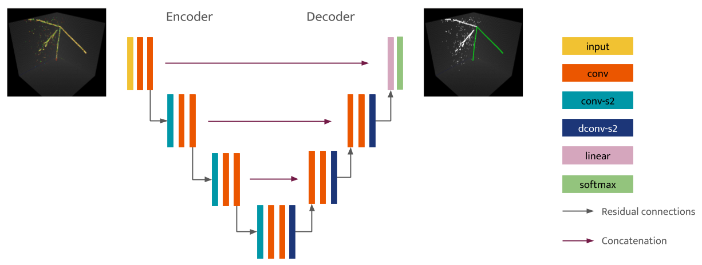
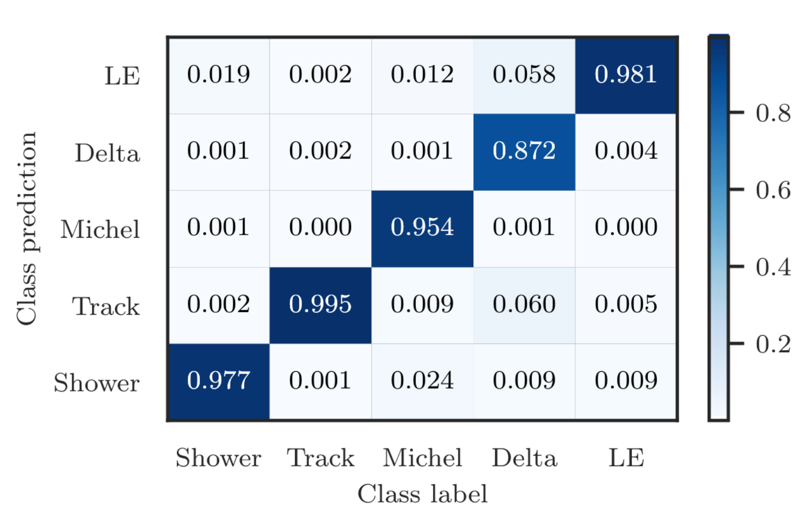
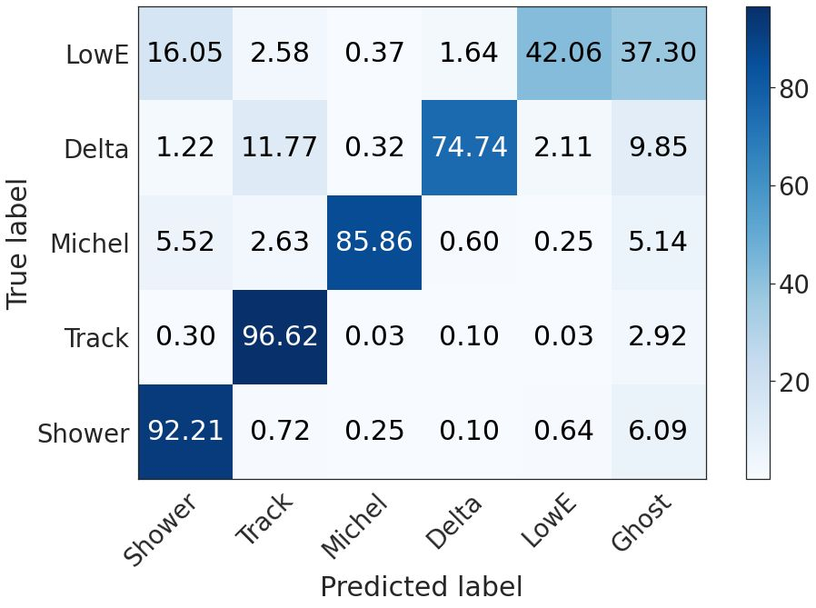
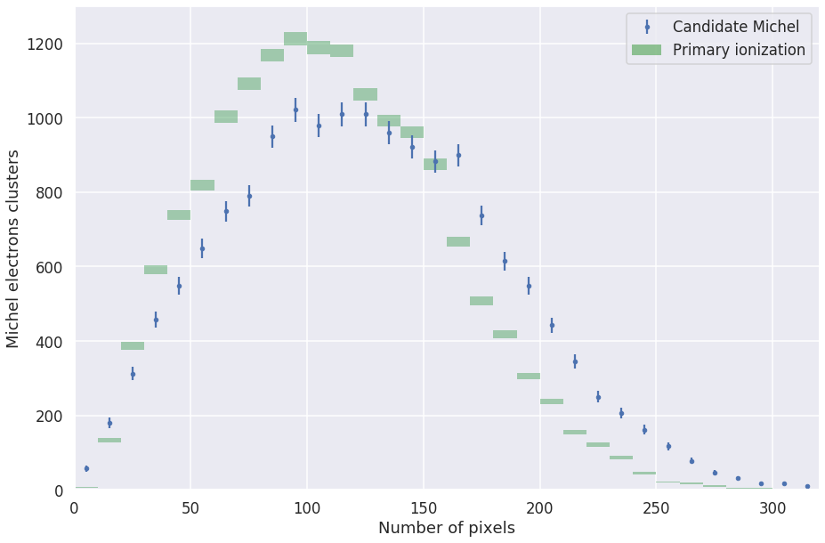
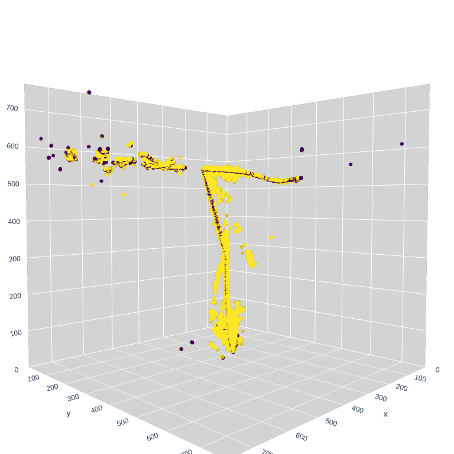
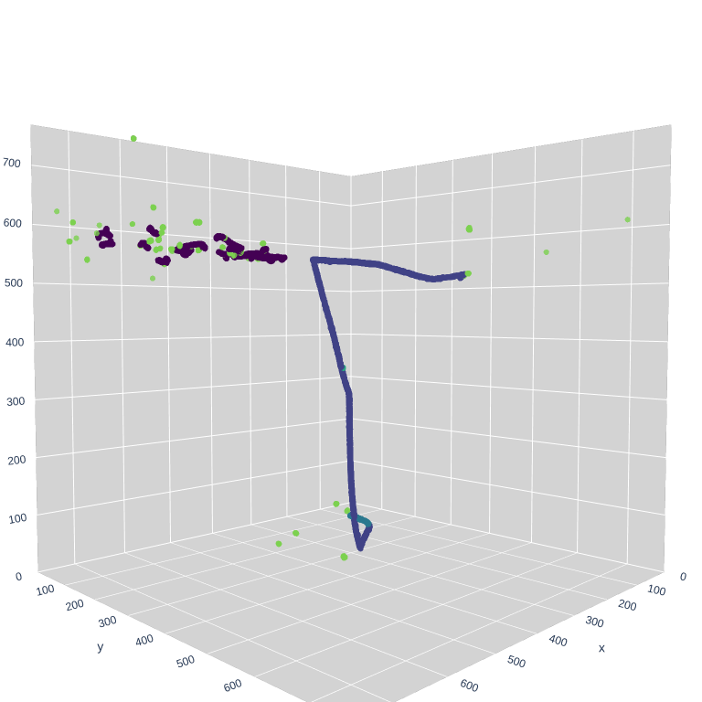

## 1. Network architecture
### Basic UResNet

### Deghosting
.png)

## 2. Performance
### PILArNet dataset (w/o ghost points)
From NIPS 2020 workshop paper, by François

### ICARUS simulation (w/ ghost points)
As of January 2021, by Laura

## 3. Michel analysis
Finding Michel electrons using UResNet semantic segmentation output only is done as follows:
1. Extract track-like and Michel-like semantic predictions.
2. Run DBSCAN to form particle clusters.
3. Identify Michel candidates that are touching the end of a muon track cluster

Pixel count spectrum using ICARUS simulation (2020):

## 4. Event displays 
(HTML? +CSV? container + config file + run script?)

.png ":size=200")  

