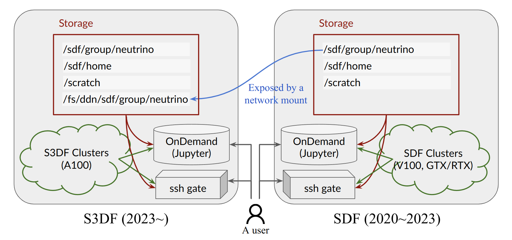

# Facilities: SDF and S3DF

At the time of writing this document (January 2023), you should know about two computing facilities at SLAC:
1. SLAC Shared Scientific Data Facility (S3DF), coming online in 2023
2. SDF (a beta version of S3DF)

Our computing resources are split between these two facilities. While arguably S3DF will be the de-facto computing facility in the near future, this is a slow process **and** there will be some remanent effects. 

This wiki contains two separate sections about SDF and S3DF. There are also documentations for both [SDF](https://sdf.slac.stanford.edu/public/doc/#/) and [S3DF](https://s3df.slac.stanford.edu/public/doc/#/). Contents of this wiki are aimed for neutrino users to get started quickly and learn about things specific for our group.

## Mostly Similar But Not Shared

SDF and S3DF are similar in many aspects. But resources are separate and not shared.
* Access
    * Both support a user to access interactively through ssh (terminal) as well as OnDemand (web-browser)
    * Both use `slurm` job scheduler for batch jobs
    * But these services and involved computing resources are not shared.
* Storage
    * `/sdf/home`, `/sdf/group/neutrino`, and `/scratch` are most frequently used storage spaces at both facilities.
    * Both support `globus` and `bbcp` for a large data transfer process.
    * But storage servers are not shared.
* Computing resources
    * Both provide CPU and GPU computing resources
    * Computing resources at S3DF is not available to SDF and vice versa.

That being said, to make SDF to S3DF transfer process easy, a group's primary storage space `/sdf/group/neutrino` at SDF is visible to S3DF (but not the other way around) via network mount. The mount point accessible from S3DF is `/fs/ddn/sdf/group/neutrino`. 

## Key Differences

There are two major differences between SDF and S3DF.

**First**, the available computing hardware types are different for the neutrino group.
* SDF hosts "old" NVIDIA GPU servers including Tesla V100, RTX 2080Ti, and GTX 1080Ti.
* S3DF hosts "new" NVIDIA GPU servers including Tesla A100.
Some of the group members may work on machine learning (ML) projects and allowed to access resources owned by the ML Initiatives (MLI) group. For the MLI group resources:
* SDF hosts some of Tesla A100 and all of RTX 2080Ti that belong to MLI
* S3DF hosts some of Tesla A100 that belong to MLI
As such, if you need an access to A100 servers, you may seek through MLI resources on SDF or neutrino/MLI resources at S3DF.

**Second**, the rules to set the availability of resources are different. At SDF, the resources we contributed (=what we "own") are made available to us whenever we fequest them. At S3DF, the availability depends on the _priority_ which is a floating point value and does not guarantee anything. The hope is that the _priority_ calculation is set and tuned such that it practically guarantees immediate access to our resources.

Accordingly, the details of how to submit `slurm` jobs to a cluster is different between SDF and S3DF. This will be detailed in the following sections

